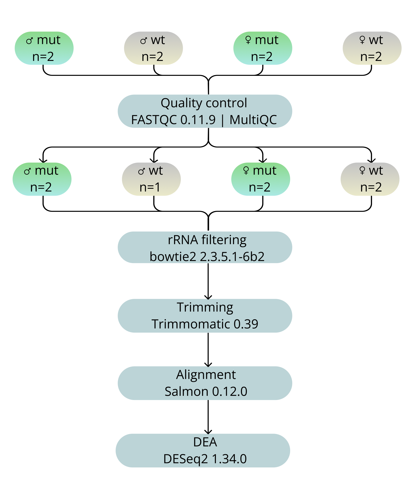
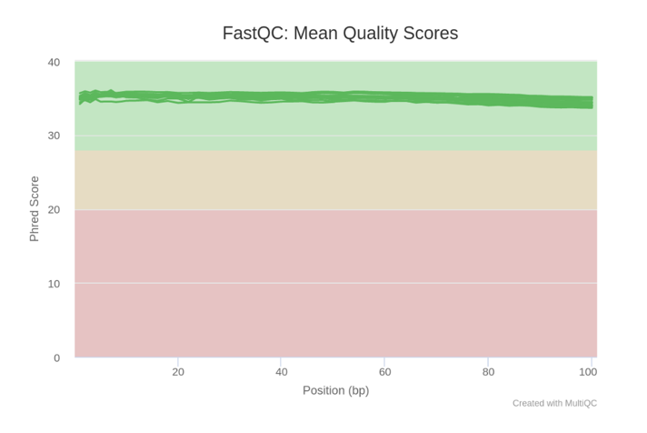
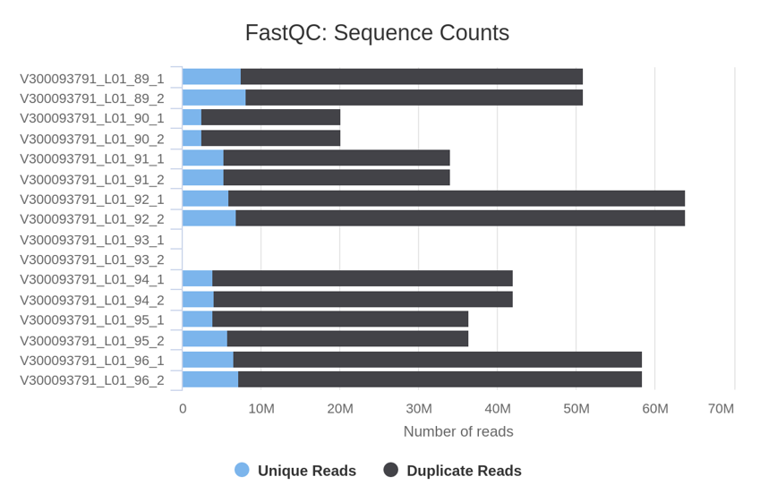
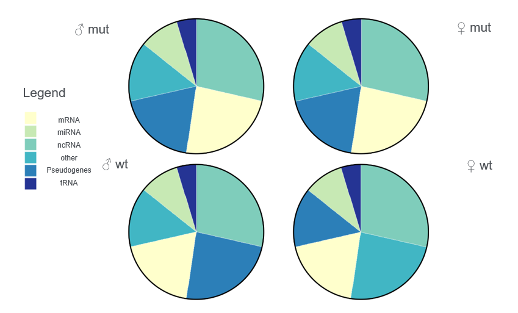
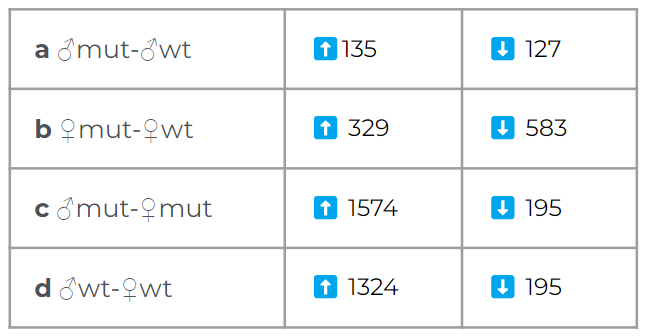
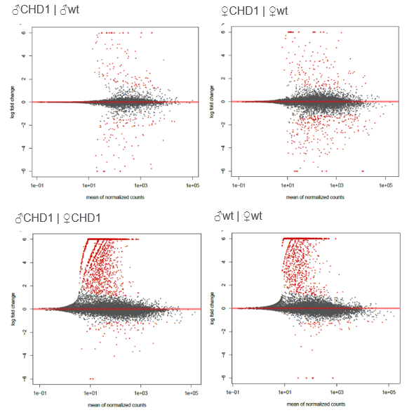
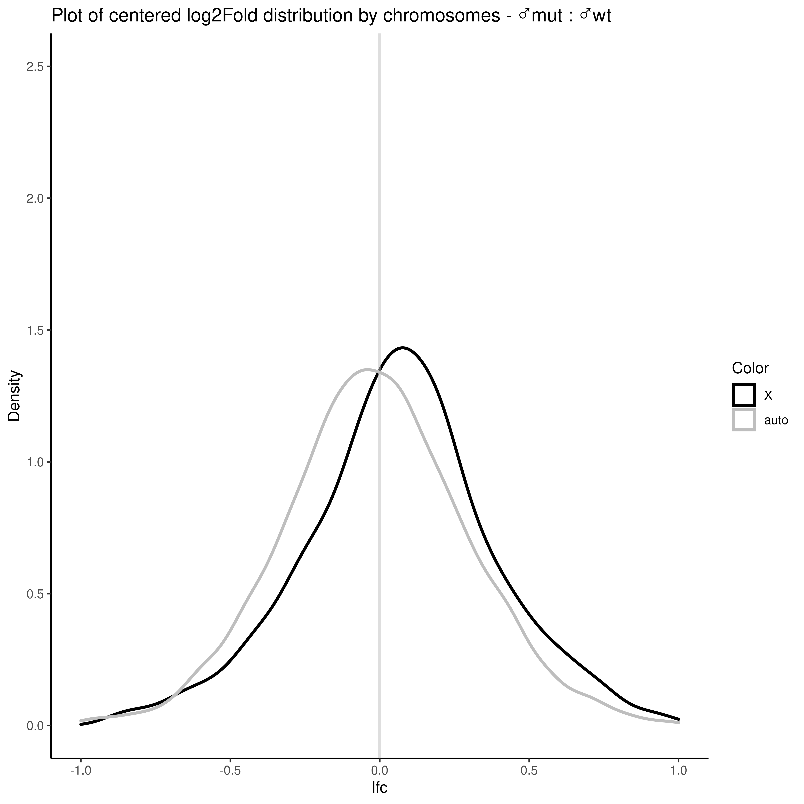
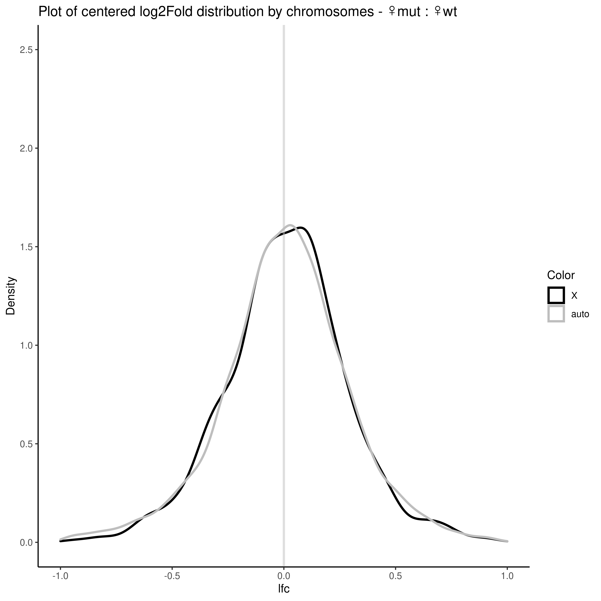

## Role of Drosophila Chromatin Remodeling Factor CHD1 in regulation of gene expression
Authors: 

- Zhanna Repinskaia
- Alexander Zhuravlev

Supervisor, affiliation:

- Alexander Konev, PNPI

### Introduction
*Drosophila melanogaster* is widely used model object in genetics. In humans and fruit flies, females and males have different sets of sex chromosomes – XX and XY. This causes gene dosage differences that must be compensated for by adjusting the expression of most genes located on the X-chromosome, the process known as dosage compensation (DC). In Drosophila DC is achieved by 2-fold upregulation of expression of most X-chromosome genes in males. Dosage compensation is widely used as a model for studies of basic principles of chromatin-based regulation of genetic activity because it requires the specific targeting of regulatory factors to particular chromosome and the coordinate regulation of transcription of many genes. Surprisingly, a little is known about the role of chromatin remodeling factors in the processes of dosage compensation. 

The aim of this project is to study the possible role of chromatin remodeling factor CHD1 (Chromo-ATPase/Helicase-DNA-binding protein 1) in the in the process of dosage compensation and in transcriptional regulation in  *Drosophila melanogaster*. We have previously demonstrated CHD1 is unique among Drosophila chromatin-remodeling factors in terms of its specific recruitment to the male X chromosome suggesting the role in DC. 

To investigate the specific roles (if any) of the CHD1 in dosage compensation and assess additional functions in regulation of gene expression we sequenced (using an MGI platform) rRNA depleted total RNA from wild type and Chd1 mutant male and female larvae. Now the task is to analyze the data acquired. We will need to perform quality control, alignment and analysis of gene differential expression in the X-chromosome and in autosomes of Drosophila males and females.

### Goal and objectives
The **goal** is to investigate the specific roles of the Drosophila chromatin remodeler CHD1 in dosage compensation and assess additional functions in regulation of gene expression using RNA-seq data.

The **objectives**:

- Quality control, alignment to Drosophila genome and transcriptome and analysis of gene differential expression 
- Analysis of possible correlations between  differential gene expression and gene features: Gene Ontology, gene length, expression levels, ubiquitously expressed or tissue  - specific, distance from DC initiation sites

### Initial data
There were **4** initial types of samples that were derived from *Drosophila melanogaster* larvae:

🪰male wt | 🪰female wt | 🪰male mutant | 🪰female mutant

The lab assistant made **2** biological replicates for each group, which yields **8** samples.

These samples were rRNA depleted and sequenced on MGISEQ platform. So, in the beginning we had **16** files, forward and reverse .fq.gz type for each sample.

### Pipeline
Our pipeline is described on a picture below ⬇️

Apart from these tools our pipeline of DEA analysis uses the following R packages:
BiocManager 1.30.16
data.table 1.14.0
DESeq2 1.32.0
dplyr 1.0.7
GenomicRanges 1.44.0
ggplot2 3.3.5
gplots 3.1.1
openxlsx 4.2.4
stringi 1.7.4
stringr 1.4.0
tidyverse 1.3.1
tximport 1.20.0

The exact actions along with our code can be accessed via the following files:
- Pre_DEA_commands.ipynb
- DEA_commands.R
- DEA_multi_try.ipynb *(this is an attempt to perform a multifactor analysis ona google server. Unfortunately, its result are very hard to interpret)*

[Click on this text to get the scripts and reference files](https://drive.google.com/drive/folders/1NPE-o1iZVF-2sharSFEwvQT3fKwZ4Qb8?usp=sharing).
Unfortunately, we could not upload the raw sequencing results since they are too big.

### Results
Apart from high duplication and adapter contamination FASTQC and MultiQC reports showed rather good quality.

However, the number of reads for sample №93 was abnormally small, so we desided to delete it from further analysis.

Alignment data also supports this decision, as almost nothing can be aligned on №93. This information is saved in the table 'Basic_Statistics.xlsx'. We also performed alignment on other types of RNA to see how the trimming and rRNA filtering affected the distribution:

mRNA and ncRNA are the most abundant in our samples and the amount of tRNA-associated data is surprisingly less than that.

Then, we finally performed differential expression analysis (DEA). The example of an output table is shown below.

This is the table of top and bottom 10 of differentially expressed genes (DEGs). The histone-encoding genes show the biggest difference in the expression. Additionally, we enclose the LFC-ranked tables for pair-wise DEA (\*ordered_ranking.xlsx). 

Overall, the amount of up- and down-regulated genes among the comparison groups are included in this table:

And the MA-plots for these groups:

Finally, we visualized the LFC distribution on X- and autosomes to see if there is any difference

for males:

for females:

The results above indicate that CHD1 mutation in *Drosophila melanogaster* males may result in the increase of overall gene expression levels. It also improves gene expression specifically on X-chromosomes in comparison to autosomes. Still, the results may be not fully correct since we had only one male wt sample, it may also be the reason why DESeq2 trims the genes so aggresively.

Functional analysis of the DEGs from the comparison of mutants and wild type organisms shows that the most prominent divergence accounts for the H1/H5 family and genes and microtubule plus-end binding activity genes.

### Conclusion
All in all, during this project we tried to perform a full analysis of RNA-seq data from quality control to DEA.
The difference between gene expression in comparison groups is subtle, yet we can see that CHD1 mutants show a shift to the right (more genes are expressed).
We also characterized genes that may be affected by a CHD1 mutation.

### Further plans
- The functional analysis of DEGs was manual. We would like to perform it with specific gene ontology tools
- We plan to align the RNA-seq data to genome and see whether there are patterns according to the structural elements of this reference.
- We may also try another R package for differential expression analysis to check the legitimacy of our results

### Links and literature
- [Flybase.org ver. 6.41](http://flybase.org/)
- [NCBI gene up-to-date ver. (05.2022)](https://www.ncbi.nlm.nih.gov/gene)
- “Babraham Bioinformatics - FastQC A Quality Control Tool for High Throughput Sequence Data.” Babraham.Ac.Uk, https://www.bioinformatics.babraham.ac.uk/projects/fastqc/. Accessed 13 Jan. 2022
- Ewels, Philip, et al. “MultiQC: Summarize Analysis Results for Multiple Tools and Samples in a Single Report.” Bioinformatics, vol. 32, no. 19, 2016, pp. 3047–3048, doi:10.1093/bioinformatics/btw354
- Langmead, Ben, and Steven L. Salzberg. “Fast Gapped-Read Alignment with Bowtie 2.” Nature Methods, vol. 9, no. 4, 2012, pp. 357–359, doi:10.1038/nmeth.1923
- Bolger, Anthony M., et al. “Trimmomatic: A Flexible Trimmer for Illumina Sequence Data.” Bioinformatics (Oxford, England), vol. 30, no. 15, 2014, pp. 2114–2120, doi:10.1093/bioinformatics/btu170
- Patro, Rob, et al. “Salmon Provides Fast and Bias-Aware Quantification of Transcript Expression.” Nature Methods, vol. 14, no. 4, 2017, pp. 417–419, doi:10.1038/nmeth.4197
- Albig, Christian, et al. “JASPer Controls Interphase Histone H3S10 Phosphorylation by Chromosomal Kinase JIL-1 in Drosophila.” Nature Communications, vol. 10, no. 1, 2019, p. 5343, doi:10.1038/s41467-019-13174-6
- Ilyin, Artem A., et al. “Comparison of Genome Architecture at Two Stages of Male Germline Cell Differentiation in Drosophila.” Nucleic Acids Research, vol. 50, no. 6, 2022, pp. 3203–3225, doi:10.1093/nar/gkac109
- Schoberleitner, Ines, et al. “CHD1 Controls H3.3 Incorporation in Adult Brain Chromatin to Maintain Metabolic Homeostasis and Normal Lifespan.” Cell Reports, vol. 37, no. 1, 2021, p. 109769, doi:10.1016/j.celrep.2021.109769
